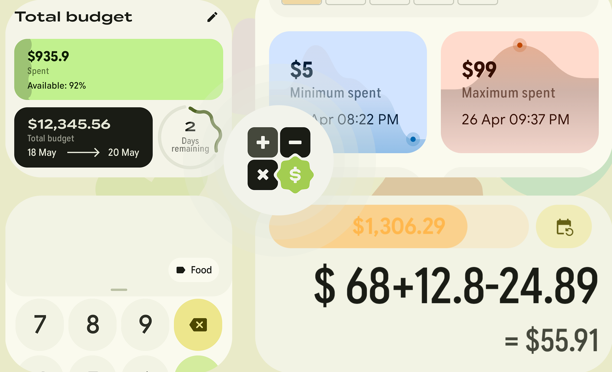
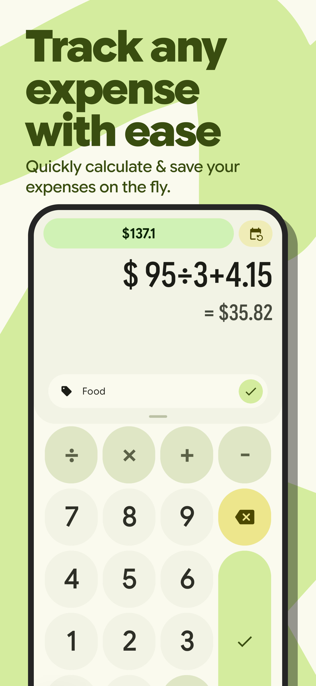
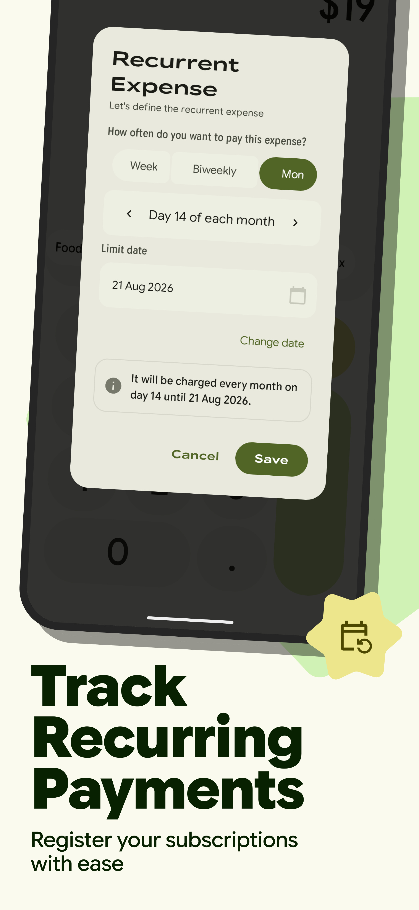
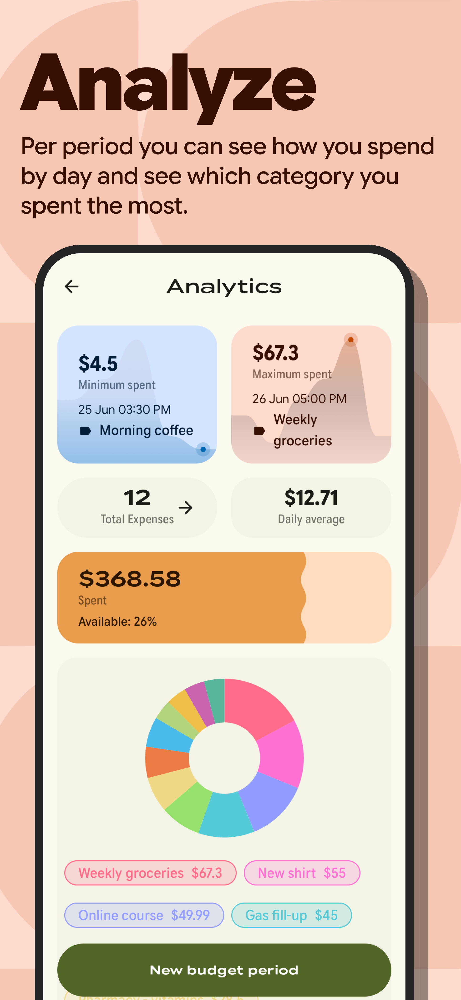
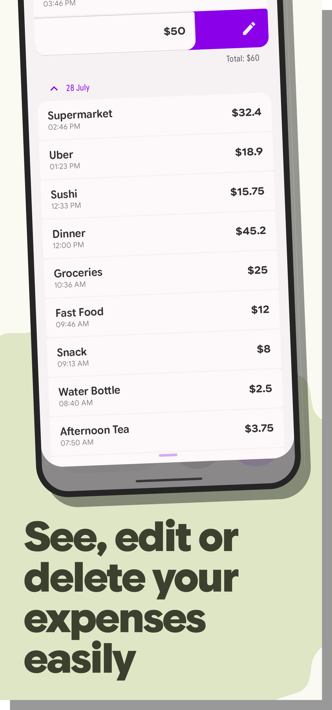
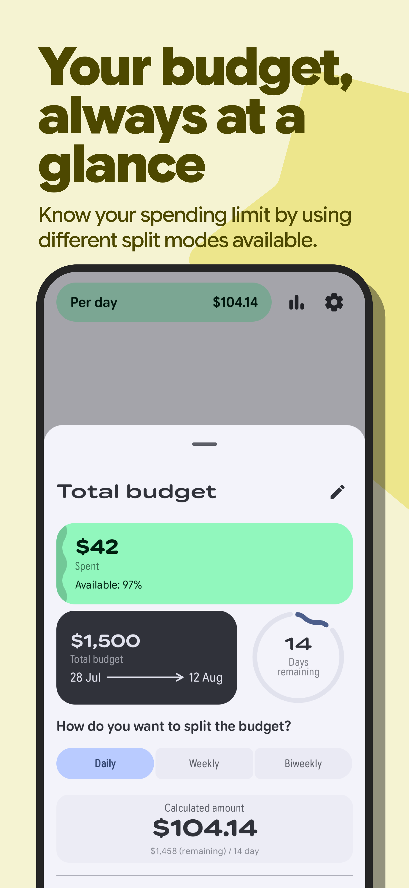
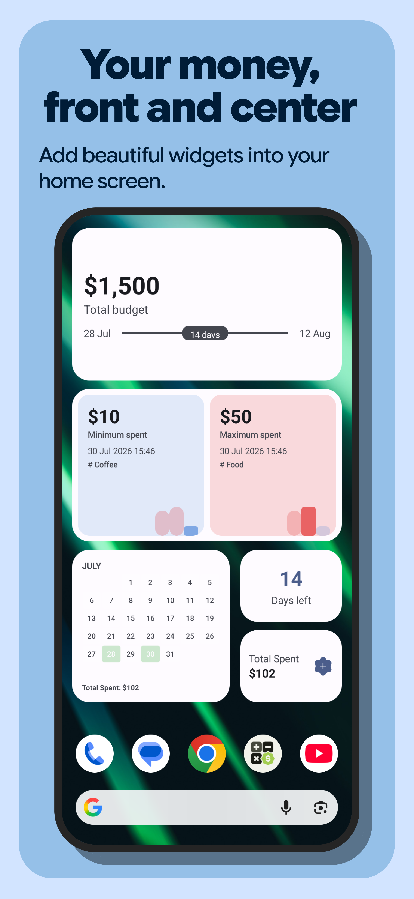

  

# وفير - Wafeer
### إدارة الميزانية والمصاريف الذكية بكل بساطة واحترافية

  <strong>تطبيق وفير (Wafeer)</strong> هو تطبيق متكامل وقوي لإدارة الميزانية والمصروفات اليومية والشهرية. يتيح لك تسجيل نفقاتك بسهولة عبر لوحة آلة حاسبة تفاعلية سريعة، ومتابعة الفواتير المتكررة، وتنظيم فترات الميزانية بدقة.

---

## 🌟 أبرز المميزات

- 💸 **تسجيل وحساب سريع وفوري:** واجهة آلة حاسبة ذكية تتيح إجراء العمليات الحسابية فوراً وتسجيل المصروف في ثوانٍ معدودة دون نماذج معقدة.
- 📅 **فترات ميزانية مرنة:** خيارات متعددة لتوزيع الميزانية (يومية، أسبوعية، نصف شهرية، وشهرية) تناسب نمط دخلك وأسلوب حياتك.
- 🔄 **المصاريف المتكررة والاشتراكات:** متابعة دورية للاشتراكات والفواتير ومواعيد استحقاق البطاقات الائتمانية مع تنبيهات استباقية قابلة للتخصيص.
- 📊 **تحليلات وتقارير بيانية:** رسوم بيانية وتوزيع نفقات حسب التصنيفات لفهم أين تذهب أموالك مع توصيات ذكية للتوفير.
- 🎨 **هوية بصرية وطباعة عربية أصيلة:** 
  - دعم **خط ثمانية (Thmanyah)** مع تفعيل الأحرف المنسدلة والمرسلة (`OpenType 'salt'`) للعناوين الرئيسية لإضفاء لمسة عربية جمالية فخمة، وخط متن مريح للقراءة.
  - دعم **خط آي بي إم بلكس (IBM Plex Sans Arabic)** لتجربة تقنية عصرية فائقة الوضوح.
  - دعم كامل للوضع الداكن المتقدم ووضع شاشات AMOLED لتوفير البطارية.
  - وضع الخصوصية وحجب الأرقام المالية.
- 💾 **نسخ احتياطي واستيراد/تصدير:** تصدير واستيراد سجل المعاملات بتنسيق CSV بسهولة لحفظ بياناتك محلياً بأمان تام.
- 📱 **ودجات للشاشة الرئيسية وتوافق Wear OS:** الوصول السريع لمؤشرات الصرف عبر الشاشة الرئيسية وساعات Wear OS.

---

<table align="center">
  <tr>
    <td></td>
    <td></td>
    <td></td>
  </tr>
  <tr>
    <td></td>
    <td></td>
    <td></td>
  </tr>
</table>

---

## 🔒 الخصوصية والأمان

تطبيق **وفير** يعمل محلياً بالكامل على جهازك. لا يتطلب تسجيل حساب، ولا يرسل بياناتك المالية أو نفقاتك لأي خوادم خارجية. بياناتك ملكك وحدك.

---

## 👨‍💻 المطور والتواصل

- **المطور:** عبدالرحمن كريم (Abdelrahman Karim)
- **البريد الإلكتروني:** [abdelrhmanBit@proton.me](mailto:abdelrhmanBit@proton.me)
